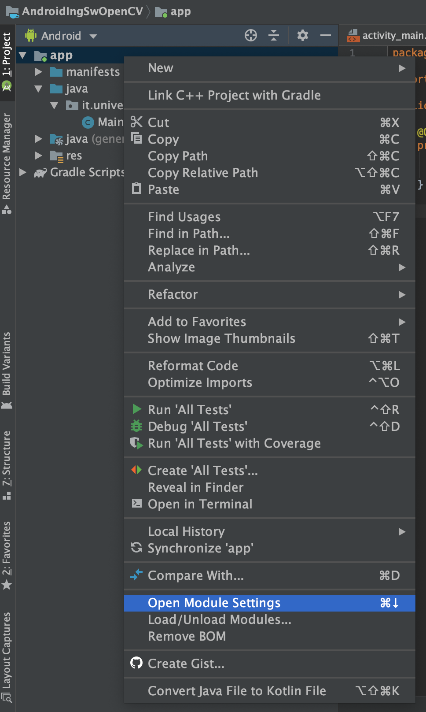
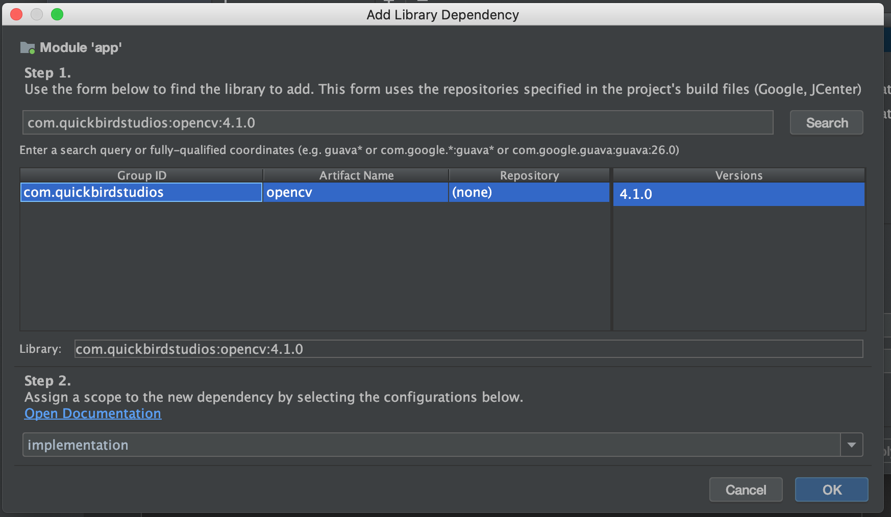

# Aggiunta di OpenCV alle App

1) Andare sul menu Module Settings, premendo tasto destro sull'app




2) Andare sulla tab Dependencies e aggiungere una Library Dependency premendo il tasto +


3) Inserire `com.quickbirdstudios:opencv:4.1.0` sulla casella di ricerca, premere Search, selezionare il primo risultato




4) Premere Ok e Ok sulle finestre aperte

5) Aggiungere la logica di caricamento della libreria sull'evento onCreate della vostra Activity

```java
public class MainActivity extends AppCompatActivity {
    @Override
    protected void onCreate(Bundle savedInstanceState) {
        super.onCreate(savedInstanceState);
        setContentView(R.layout.activity_main);

        if (!OpenCVLoader.initDebug()) {
            Log.e("AndroidIngSwOpenCV", "Unable to load OpenCV");
        } else {
            Log.d("AndroidIngSwOpenCV", "OpenCV loaded");
        }
    }
}
```

6) Inserire i permessi per accedere alla fotocamera nell'Android Manifest (manifests/AndroidManifest.xml)

```xml
...

    <uses-permission android:name="android.permission.CAMERA"/>

    <uses-feature android:name="android.hardware.camera" android:required="false"/>
    <uses-feature android:name="android.hardware.camera.autofocus" android:required="false"/>
    <uses-feature android:name="android.hardware.camera.front" android:required="false"/>
    <uses-feature android:name="android.hardware.camera.front.autofocus" android:required="false"/>

</manifest>
```


Ora potrete usare la libreria OpenCV, come mostrato nell'esempio.

# Aggiungere findBalls e findLines alle App

1) Copiare i file `Ball.java`, `BallFinder.java` e `LineFinder.java` all'interno della cartella dei sorgenti del progetto, dove è presente la vostra Activity (`/app/src/main/[nome_package]`).

2) All'interno del file di layout della vostra Activity (`activity_nomeactivity.xml`), dentro i tag che racchiudono il layout principale, aggiungere il seguente codice:

```xml
...
    <org.opencv.android.JavaCameraView
            android:layout_width="fill_parent"
            android:layout_height="fill_parent"
            android:visibility="gone"
            android:id="@+id/OpenCvView"
            opencv:show_fps="true"
        opencv:camera_id="any" />
...
```

3) All'interno del codice della vostra Activity aggiungere il seguente codice:

```java
public class MainActivity extends AppCompatActivity {
    private CameraBridgeViewBase mOpenCvCameraView;
   
    @Override
    protected void onCreate(Bundle savedInstanceState) {
...
        if (!OpenCVLoader.initDebug()) {
            Log.e("AndroidIngSwOpenCV", "Unable to load OpenCV");
        } else {
            Log.d("AndroidIngSwOpenCV", "OpenCV loaded");
        }
...
        mOpenCvCameraView = findViewById(R.id.OpenCvView);
        mOpenCvCameraView.setVisibility(SurfaceView.VISIBLE);
        mOpenCvCameraView.setMaxFrameSize(640, 480);
        mOpenCvCameraView.setCvCameraViewListener(new CameraBridgeViewBase.CvCameraViewListener2() {
            @Override
            public void onCameraViewStarted(int width, int height) {

            }

            @Override
            public void onCameraViewStopped() {

            }

            @Override
            public Mat onCameraFrame(CameraBridgeViewBase.CvCameraViewFrame inputFrame) {
                Mat frame = inputFrame.rgba();
                
                return frame;
            }
        });
        
        mOpenCvCameraView.enableView();
    }
}
```

# Usare findBalls

La classe FindBalls prevede un costruttore, vari setter e una funzione findBalls.

Il costruttore prende come parametri:
- `Mat frame`: il frame ottenuto dalla fotocamera in formato rgba
- `boolean debug`: parametro opzionale, per mostrare all'interno del frame il funzionamento della classe (attenzione: se è uguale a `true` scrive nel frame).
Nella modalità debug, i contorni degli oggetti rilevati sono mostrati da una linea rossa fine, e le mine sono descritte da un cerchio del colore rilevato (nero se non è possibile capire il colore).

I setter più importanti sono:
- `setOrientation(String orientation)`: prende una stringa che può essere **"portrait"** (telefono in verticale), oppure **"landscape"** (telefono in orizzontale). L'orientamento di default è portrait.
Se l'orientamento è settato a "portrait" la funzione `findBalls()` effettuerà i calcoli asserendo che il telefono è tenuto in verticale, se invece è "landscape" il comportamento di `findBalls()` rimarrà invariato (questo perché OpenCV è stato ideato solo per funzionare in modalità landscape, e non è possibile girare la visualizzazione della fotocamera).
Se volete evitare di usare la modalità portrait e tenere comunque il telefono in verticale è necessario ruotare la matrice contenente il frame prima di passarlo al costruttore.
- `setMinArea(int min_area)`: imposta l'area minima di un oggetto affiché venga rilevato come possibile mina. Se è troppo grande non rileverà le palline più distanti, se è troppo piccolo è possibile che rilevi falsi positivi.
- `setViewRatio(float view_ratio)`: imposta l'altezza, partendo dall'alto del frame, sopra il quale ignorare gli oggetti rilevati. Se la modalità di debug è attiva, è visibile sotto forma di una linea azzurra all'interno del frame. Prende un numero decimale compreso tra 0 e 1, dove 0 è la parte più alta del frame, 0.5 è metà e 1 è la parte più bassa del frame.

All'interno della classe `BallFinder` sono presenti altri setter che permettono di regolare le soglie dei colori (nel formato HSV) e della saturazione (da 0 a 255) per la rilevazione degli oggetti.
I parametri di default sono calibrati per funzionare nel campo da gioco dichiarato dalle specifiche (edificio Zeta, secondo piano, rombo con le mattonelle rosa) in condizione di luce ottimale, **e non altrove**.

La funzione principale della classe è `findBalls()`, e restituisce un ArrayList di oggetti `Ball`. Un oggetto `Ball` è composto nel seguente modo:

- `double center.x`: coordinate in pixel all'interno del frame della coordinata x del centro della mina trovata
- `double center.y`: coordinate in pixel all'interno del frame della coordinata y del centro della mina trovata
- `float radius`: raggio della mina trovata
- `String color`: colore della mina trovata, può essere "red", "blue", "yellow" o "unknown"

Se la funzione `findBalls()` viene utilizzata al di fuori del campo da gioco verranno rilevati falsi positivi, quindi per verificarne il corretto funzionamento è necessario utilizzarla nel campo da gioco.

Esempio di utilizzo di findBalls:

```java
...
            @Override
            public Mat onCameraFrame(CameraBridgeViewBase.CvCameraViewFrame inputFrame) {
                Mat frame = inputFrame.rgba();

                BallFinder ballFinder = new BallFinder(frame, true);
                ballFinder.setViewRatio(0.33f);
                ballFinder.setMinArea(200);
                ballFinder.setOrientation("landscape");
                ArrayList<Ball> balls = ballFinder.findBalls();

                for (Ball ball : balls) {
                    Log.e("Ball x", String.valueOf(ball.center.x));
                    Log.e("Ball y", String.valueOf(ball.center.y));
                    Log.e("Ball radius", String.valueOf(ball.radius));
                    Log.e("Ball color", ball.color);
                }

                return frame;
            }
...
```
