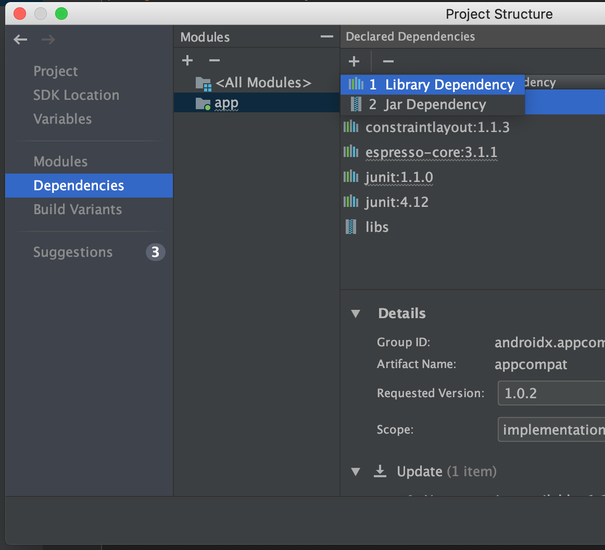

# Aggiunta di OpenCV alle App

1) Andare sul menu Module Settings, premendo tasto destro sull'app


2) Andare sulla tab Dependencies e aggiungere una Library Dependency premendo il tasto +




3) Inserire `com.quickbirdstudios:opencv:4.1.0` sulla casella di ricerca, premere Search, selezionare il primo risultato


4) Premere Ok e Ok sulle finestre aperte

5) Aggiungere la logica di caricamento della libreria sull'evento onCreate della vostra Activity

```java
public class MainActivity extends AppCompatActivity {
    @Override
    protected void onCreate(Bundle savedInstanceState) {
        super.onCreate(savedInstanceState);
        setContentView(R.layout.activity_main);

        if (!OpenCVLoader.initDebug()) {
            Log.e("AndroidIngSwOpenCV", "Unable to load OpenCV");
        } else {
            Log.d("AndroidIngSwOpenCV", "OpenCV loaded");
        }
    }
}
```


Ora potrete usare la libreria OpenCV, come mostrato nell'esempio.